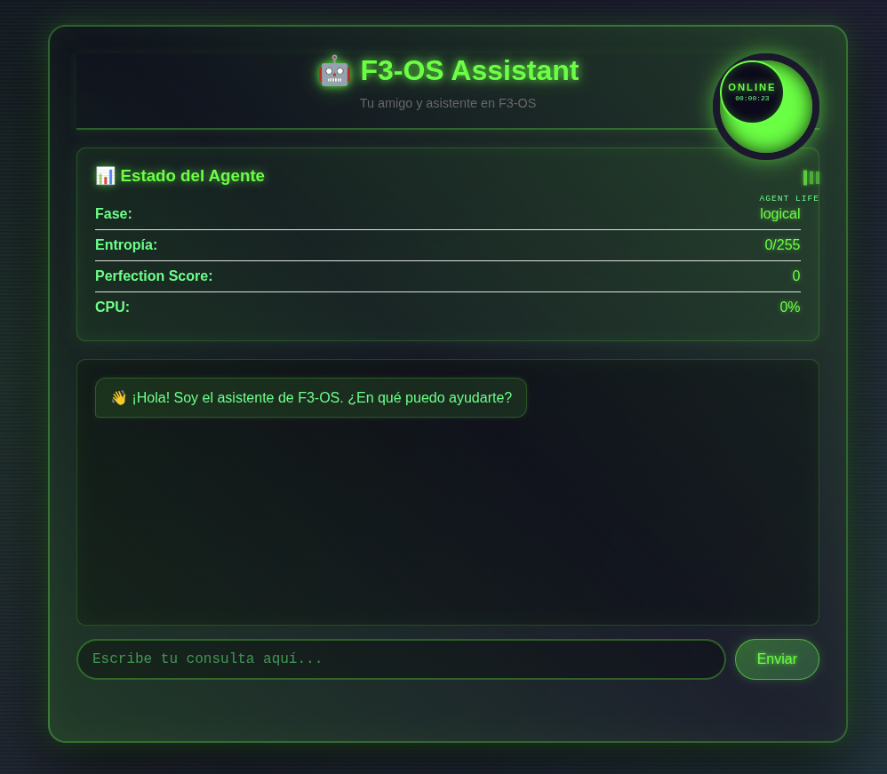

# F3-OS Governance Agent

Agente AI especializado que gobierna el desarrollo de F3-OS, manteniendo coherencia con el modelo F3.

## Arquitectura

El agente replica la estructura del F3 Core:

- **Code Analyzer** (CPU Thread): Analiza código propuesto
- **Context Manager** (RAM Thread): Mantiene contexto del proyecto
- **Synthesis Engine** (MEM Thread): Sintetiza propuestas y genera feedback
- **Governance Core** (F3 Core): Toma decisiones finales

## Instalación

```bash
cd agent
pip install -r requirements.txt
```

## Configuración

1. Copia `config/config.example.yaml` a `config/config.yaml`
2. Configura tus tokens de GitHub y API keys
3. Ajusta los parámetros según necesites

## Uso

### Método Recomendado: Script de Ejecución

```bash
cd agent
./run.sh [comando]
```

El script `run.sh`:
- ✅ Verifica que Python esté instalado
- ✅ Crea archivo de configuración si no existe
- ✅ Instala dependencias automáticamente si faltan
- ✅ Ejecuta el agente correctamente

### Comandos Disponibles

**Evaluar un PR específico:**
```bash
./run.sh evaluate-pr --pr 123
```

**Monitorear PRs automáticamente:**
```bash
./run.sh monitor
```

**Ver estado del agente:**
```bash
./run.sh status
```

**Ejecutar ciclo completo:**
```bash
./run.sh cycle
```

**Iniciar servidor GUI del asistente:**
```bash
./run.sh gui-server --port 8080
```

Luego abre en tu navegador: `http://localhost:8080`

## Interfaz GUI

El agente incluye una interfaz web completa con diseño futurista estilo Star Wars/Fórmula 1.

### Captura de Pantalla



*Interfaz del asistente con indicador de vida del agente, panel de estado y chat interactivo*

> **Nota**: Si la imagen no se muestra, asegúrate de que `gui_web/screenshot.png` existe. Ver [README_IMAGEN.md](gui_web/README_IMAGEN.md) para instrucciones de captura.

### Características de la Interfaz

- **Indicador de Vida del Agente**: Reloj circular estilo F1/Star Wars que muestra el tiempo activo
- **Panel de Estado**: Métricas en tiempo real (fase, entropía, perfection score, CPU)
- **Chat Interactivo**: Conversación en tiempo real con el asistente
- **Tema Futurista**: Diseño oscuro con acentos verdes neón
- **Base de Conocimiento Completa**: El asistente tiene acceso a toda la documentación del proyecto

Para más detalles, ver [INTERFAZ_DESCRIPCION.md](gui_web/INTERFAZ_DESCRIPCION.md)

### Método Alternativo: Ejecución Directa

```bash
cd agent
python3 run_agent.py [comando]
```

Esto inicia un servidor HTTP que la GUI de F3-OS puede usar para comunicarse con el asistente.

## Documentación

Ver [AGENTE_GOBERNANTE.md](../AGENTE_GOBERNANTE.md) para la visión completa.

